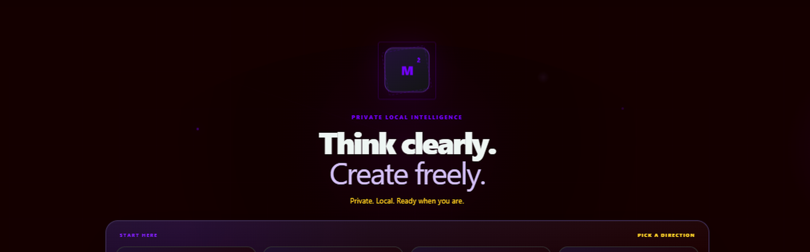
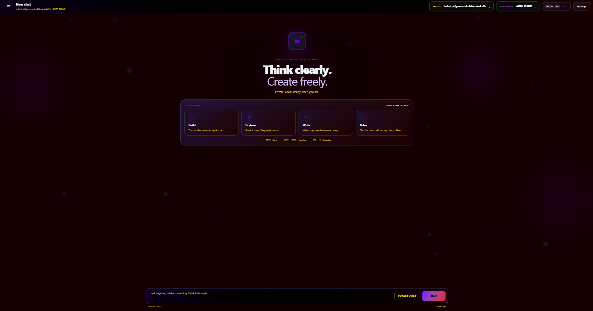

<p align="center">
  
</p>

# CypraStudio

CypraStudio is a portable, privacy-first Windows AI workspace powered by Ollama, combining local chat, reasoning, retrieval, specialists, voice output, GGUF model management, secure localhost controls, customizable UI, and offline-first operation in one streamlined desktop Studio.

## About CypraStudio

**CypraStudio** is a local-first Windows desktop AI workspace built for private, portable use with Ollama. It combines a native WebView2 interface, project-owned model storage, streaming conversations, configurable reasoning, lightweight local retrieval, specialist profiles, voice output, model management, and extensive appearance controls in one self-contained Studio. The application is designed so the primary chat path remains local: prompts are sent to a loopback-only Ollama runtime, models are stored under the project’s own `OllamaModels` directory, conversations and settings remain in project-local data, and the desktop interface talks only to its local FastAPI backend. Online behavior is limited and explicit. Public Hugging Face GGUF downloads occur only when the user requests a model import, and Microsoft Edge neural TTS is protected by a separate opt-in privacy gate. Browser/device speech and local Piper speech remain available without using Edge TTS.

CypraStudio focuses on a clean single-user desktop workflow rather than a background autonomous-agent system. Chats support streaming, stop/retry, message editing, response regeneration, reasoning modes, per-conversation generation locking, saved drafts, pinned sessions, search, export, recovery, and local cross-chat recall. Its retrieval layer intentionally stays lightweight: SQLite FTS5 indexes supported files from the local `Knowledge` folder and saved conversations without running a separate embedding model or visual memory graph. A manual Specialists browser exposes the Studio’s role registry without silently routing prompts through agents.

The runtime layer manages a private Ollama server, detects model residency, supports warm/unload/reconnect/kill controls, maintains a one-loaded-model policy, and protects the project model store from inherited environment overrides. Public GGUF repositories can be inspected and imported through a bounded Hugging Face workflow with commit pinning, size limits, SHA-256 verification, resumable temporary downloads, and no execution of repository code. The interface can be heavily customized with themes, colors, gradients, scaling, glass, glow, motion, and local background artwork while preserving settings through crash-resistant atomic writes and last-known-good recovery.

Security is part of the runtime architecture rather than an optional mode. CypraStudio validates loopback hosts, blocks cross-site browser requests, applies same-origin checks to state changes, limits request bodies, validates uploaded image signatures, constrains local identifiers and paths, and sanitizes text before optional online TTS. The result is a compact AI Studio intended to remain understandable, portable, configurable, and private by default while still offering controlled access to optional online services when the user deliberately enables them.

## Preview

<p align="center">
  
</p>

> Current build: `2.3.16-edge-voice-switch-20260916`

## Features

### Local AI runtime

- Private Ollama runtime bound to loopback.
- Project-local `OllamaModels` store; the host Ollama model library is not used by Studio model management.
- One-loaded-model policy with model residency reporting.
- Warm, unload, reconnect, and verified **Kill Host** controls.
- Runtime ownership tracking and stale private-runtime cleanup.
- Configurable context size, keep-alive, reply-token limit, and model selection.
- GPU-first behavior for the factory model and imported Hugging Face GGUF models, with controlled partial-offload fallback when required.
- Memory-mapped loading for supported partial/CPU-resident paths.

### Chat and reasoning

- Streaming local chat with stop and retry states.
- `AUTO`, `STANDARD`, and `DEEP` reasoning modes.
- Direct AUTO routes explicitly disable model thinking when reasoning is not needed.
- Optional collapsible model-thinking trace.
- Edit a user message and resend from that point.
- Regenerate the latest assistant response.
- Per-chat generation profile locking after the first message.
- Configurable temperature, history depth, and base system prompt.
- Friendly runtime/model error states instead of raw backend failures.
- Response metadata for model and reasoning mode.

### Conversations

- Persistent local chat sessions.
- Optional first-message automatic titles.
- Rename, pin/unpin, search, export, and soft-delete.
- Undo/restore for recently deleted chats.
- Saved per-chat drafts and scroll position.
- Automatic restoration of the active conversation and sidebar state.
- Pinned and recent conversations kept visually distinct.

### Quiet local retrieval

- Local SQLite FTS5 retrieval with no separate embedding model.
- Incremental indexing of supported files placed in `Knowledge/`.
- Older-turn retrieval from the active chat.
- Incremental cross-chat recall from saved conversations.
- Bounded retrieved context injected as untrusted reference material.
- Independent controls for current-chat memory, cross-chat memory, and Knowledge-folder retrieval.
- Manual **Open Knowledge Folder** and **Reindex** controls.

### Specialists

- Manual Specialists browser backed by the Studio role registry.
- Group browsing and explicit specialist selection.
- No automatic agent routing or hidden autonomous task execution.
- Default system prompt remains active when no specialist is selected.

### Voice output

- Device/browser speech.
- Optional local Piper speech with CPU-thread control.
- Optional Microsoft Edge neural TTS with explicit online privacy opt-in.
- Full Edge voice catalog discovery with friendly name, locale, and gender.
- Provider-aware controls that swap between Browser, Edge, Piper, and Off.
- Voice preview, stop/cancel, auto-speak, and per-response **SPEAK**.
- Configurable rate, pitch, maximum spoken characters, and Edge failure fallback.
- Optional skipping of URLs and code blocks.
- Bounded synthesis queue and sanitization before online Edge synthesis.

### Hugging Face GGUF import

- Search/inspect public, non-gated Hugging Face repositories.
- Import individual or split `.gguf` model sets.
- Repository commit pinning before download.
- HTTPS downloads with bounded retry/resume and cancellable `.part` files.
- File-size and aggregate-size safety ceilings.
- Free-space checks before installation.
- SHA-256 verification before model registration.
- Repository scripts, Python files, binaries, and arbitrary assets are never executed as part of import.
- Installed models enter the same project-local Ollama store and model selector.
- Conservative 6 GB fit guidance for GGUF choices.

### Appearance

- Dark and light modes plus theme presets.
- Custom primary/secondary accents, canvas, panels, messages, and muted text colors.
- Interface gradients and adjustable strength.
- UI scale, chat scale, density, panel opacity, glass blur, glow, and motion controls.
- PNG, JPEG, and WebP custom backgrounds stored locally.
- Aspect-correct background composition with optional edge-fill blur.
- Independent image opacity and neutral darken/wash controls.
- Persisted window geometry.

### Import, export, and recovery

- Export the current chat.
- Export/import workspace state without replacing unrelated existing chats.
- Export/import appearance-only themes.
- Atomic JSON writes for persistent state.
- `settings.lastgood.json` recovery copy.
- Fast settings autosave and save-on-control-change behavior.
- **Reset Program State** preserves chats and local Ollama models.
- Release archives do not ship mutable user settings/state files.

### Maintenance

- Bundled **CYPRA CLEAN** Windows maintenance utility.
- Pre-clean snapshot and PASS/WARN/SKIP/FAIL verification states.
- Read-only scan mode.
- Per-session maintenance logs under `Logs/CypraClean/`.
- Standalone `kill-localhost.ps1` utility plus project-only mode used by CypraStudio.

### Security controls

- Loopback-only application trust boundary.
- Host validation and global cross-site browser-request blocking.
- Same-origin enforcement for state-changing requests.
- CSP, frame, MIME-sniffing, and referrer protections.
- Bounded HTTP request bodies, including streamed/chunked bodies.
- File-signature validation for uploaded background images.
- Safe session/model identifiers and project-scoped filesystem handling.
- Ollama endpoint and model store reasserted to project-local values.
- Edge TTS disabled unless explicitly allowed.
- TTS sanitization removes credential-shaped text, internal prompt/context markers, private paths, and configured code/URL content before online synthesis.
- Third-party exception details are not forwarded into speech output.

See [Security.md](Security.md) for the security model and vulnerability-reporting guidance.

## Requirements

CypraStudio targets Windows and expects:

- Windows 10 or Windows 11.
- Ollama installed, or an Ollama executable discoverable by the launcher.
- Microsoft WebView2 Runtime for the native desktop shell.
- Python 3.11–3.14, **or** the optional bundled `Setup/\u200bPython312` runtime.
- Sufficient RAM/VRAM for the model you choose.

The launcher creates and manages a project-local `.venv`. Core Python dependencies are installed from bundled/offline setup resources when available, otherwise from the configured online Python package source. Edge TTS support is only prepared when that optional provider is enabled.

## Launch

Run:

```text
START.bat
```

The launcher validates the Python environment, prepares or reconnects the private Ollama runtime, checks the selected model, prevents duplicate CypraStudio desktop instances for the same project root, starts the native desktop shell, and closes the temporary boot console after handoff.

First launch may take longer while the environment or starter model is prepared.

Runtime logs are written under the project-local `data/` directory, including setup and launch diagnostics.

## Project data

Important project-local locations include:

```text
CypraStudio/
├─ docs/                 GitHub header and interface screenshots
├─ Knowledge/            Local retrieval documents
├─ OllamaModels/         Private Ollama model store and runtime ownership data
├─ data/                 Settings, sessions, UI state, indexes, logs, backgrounds
├─ Logs/CypraClean/      Maintenance logs
├─ engine/               Runtime, reasoning, retrieval, storage, and security logic
├─ tts/                  Voice policy, sanitization, and synthesis services
├─ templates/            Desktop Web UI markup
└─ static/               Desktop Web UI assets
```

User-generated directories are created as needed and may not exist in a clean release archive.

## Keyboard shortcuts

| Shortcut | Action |
| --- | --- |
| `Ctrl+N` | New chat |
| `Ctrl+,` | Open Settings |
| `Ctrl+K` | Open command palette |
| `/` | Focus conversation search |
| `Ctrl+Shift+R` | Retry latest response |
| `Esc` | Close the active panel or stop generation |

## Privacy and network behavior

CypraStudio is local-first, not universally offline. Normal Ollama chat, local retrieval, saved conversations, and Piper TTS are designed to remain on the machine. Browser/device speech is handed to the local WebView/browser speech interface; CypraStudio does not route it through Edge TTS, although the operating system or installed voice provider ultimately controls how that device voice is implemented. Network access can occur when the user explicitly performs an online action such as:

- installing Python dependencies when no compatible offline package source is available;
- downloading a public GGUF model from Hugging Face;
- enabling Microsoft Edge neural TTS and synthesizing speech.

Edge TTS has its own explicit privacy gate. Do not enable it for text you do not want sent to Microsoft’s speech service.

## Scope

This branch intentionally does **not** restore the retired Brain/visual-graph RAG system, Finance workspace, Code Swarm, hidden legacy pages, autonomous Work/tasks system, or old realtime/STT voice workspace. Retrieval is quiet and lexical, Specialists are manually selected, and voice output is isolated from memory and agent routing.

## License

CypraStudio is released under the [MIT License](LICENSE).
